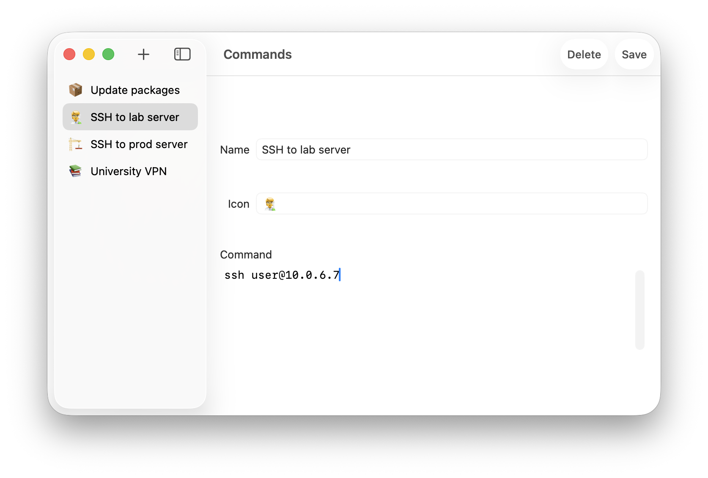
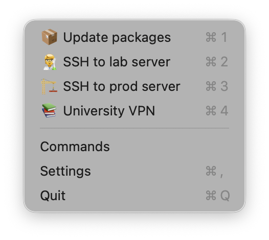

    

<h1 align="center">Commandoak</h1>

Menu bar app for executing terminal commands with one click

 

    
    

##

[Description](#-description) | [Usage](#-usage) | [Development](#-development) | [Contribution](#-contribution) | [License](#%EF%B8%8F-license)

## 📙 Description

Introducing Commandoak, your macOS app for streamlined command execution! 🚀
Define your commands with emojis and names, then effortlessly execute them in a new, interactive default Terminal window.
From routine updates to SSH connections, Commandoak simplifies your workflow with its intuitive menu bar interface.
Whether you're a developer, sysadmin, or Mac enthusiast, Commandoak empowers you to execute common commands effortlessly.
Say goodbye to tedious typing and hello to efficiency with Commandoak – your trusted terminal companion!

### Screenshots

## 🖥 Usage

The latest version of the app can be downloaded and installed from the releases page.

Once started, you can begin creating commands in the settings window and define a name, an emoji shortcut
and the command to execute.
These commands will then appear in the menu bar, and clicking on them will execute
the underlying command in a new Terminal window.

## 🧑‍💻 Development

Commandoak is a native macOS app developed using Swift and SwiftUI.
It uses SwiftData to store the defined commands.
Thanks to its simplicity, no dependencies are required and the app can just be built as an Xcode project.

Before comitting code, two mandatory checks need to be executed:

Lint code using SwiftLint: `swiftlint lint .`  
Format code style using SwiftFormat: `swiftformat .`

Both tools can be installed using [Homebrew](https://brew.sh) (`brew install swiftlint` and `brew install swiftformat`), as done in the [CI pipelines](https://github.com/jarne/commandoak/blob/main/.github/workflows/lint-code.yml).

## 🙋‍ Contribution

Contributions are always very welcome! It's completely equal if you're a beginner or a more experienced developer.

Thanks for your interest 🎉👍!

## 👨‍⚖️ License

[MIT](https://github.com/jarne/commandoak/blob/master/LICENSE)
