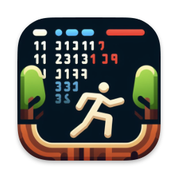

    

<h1 align="center">Commandoak</h1>

Menu bar app for one-click execution of terminal commands

 

    
    

##

[Description](#-description) | [Usage](#-usage) | [Development](#-development) | [Contribution](#-contribution) | [License](#%EF%B8%8F-license)

## 📙 Description

Introducing Commandoak, your macOS app for streamlined command execution! 🚀
Define your commands with emojis and names, then effortlessly execute them in a new, interactive default Terminal window.
From routine updates to SSH connections, Commandoak simplifies your workflow with its intuitive menu bar interface.
Whether you're a developer, sysadmin, or Mac enthusiast, Commandoak empowers you to execute common commands effortlessly.
Say goodbye to tedious typing and hello to efficiency with Commandoak – your trusted terminal companion!

### Screenshots

## 🖥 Usage

The latest version of this app can be downloaded and installed from the releases page.

Once started, you can start creating commands in the settings window and define a name, an emoji shortcut
and the command to execute.
They will appear in the menu bar and clicking them will execute the underlying command in a new Terminal window.

## 🧑‍💻 Development

Commandoak is a native app written in Swift and SwiftUI.
It uses SwiftData to store the defined commands.
Due to its simplicty, no dependencies are required and the app can just be built as an Xcode project.

## 🙋‍ Contribution

Contributions are always very welcome! It's completely equal if you're a beginner or a more experienced developer.

Thanks for your interest 🎉👍!

## 👨‍⚖️ License

[MIT](https://github.com/jarne/commandoak/blob/master/LICENSE)
